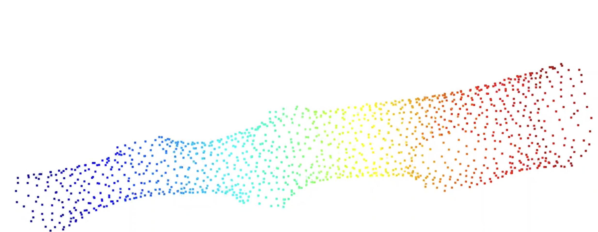
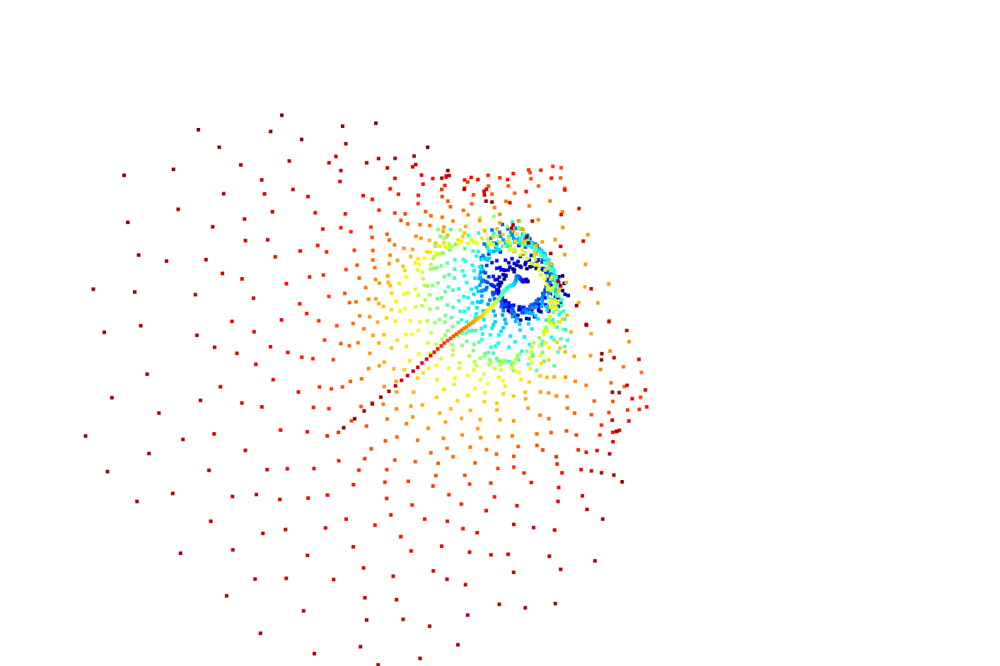

# Tubular Object Centerline Estimation

This repository provides a method for estimating the centerline of a tubular object by aligning the main axis to the z-axis, identifying boundary points, and fitting circles along the centerline to determine the center points and radii at each step.

## Overview

The goal of this project is to estimate the centerline of a tubular object (such as a pipe or a cylindrical structure) using 3D point cloud data. This process involves transforming the object’s main axis to align with the z-axis, then sampling along the centerline to fit circles at each step.

### Key Steps

### Part 1: Align Main Axis to the z-Axis
1. **Import a tubular point cloud model**: The model is imported in 3D space using a format like `.ply`.
2. **Compute the main axis of the object**: Use Principal Component Analysis (PCA) to determine the main axis of the tube.
3. **Compute the rotation matrix**: Calculate the rotation matrix required to align the object’s main axis with the z-axis.
4. **Apply the rotation to the point cloud**: Transform the entire point cloud by applying the calculated rotation matrix.
5. **Visualize the original and transformed point cloud**: Use Open3D to display both the original and the transformed (aligned) object.

### Part 2: Centerline and Boundary Extraction
1. **Identify boundary points**: Detect the boundary points along the main axis of the tubular object, particularly the start and end points.
2. **Generate a centerline**: Connect the start and end points of the tubular object and create 100 evenly spaced sample points along this line, representing the centerline.
3. **Plane projection and point selection**:
   - For each point `p_i` on the centerline, define a projection plane `P_i` that is perpendicular to the main axis.
   - Select the set of points `C_i` from the point cloud that are within a threshold distance `thresh` from the projection plane.
4. **Fit a circle in each projection plane**:
   - Project the selected points `C_i` onto the projection plane.
   - Perform a 2D circle fit in the plane to obtain the center `c_i` and the radius `r_i`.
5. **Construct the centerline**: Traverse all sampled points along the centerline, extract the circle centers, and form the continuous centerline.

## Dependencies

- Python 3.6
- [NumPy](https://numpy.org/)
- [SciPy](https://scipy.org/)
- [Open3D](http://www.open3d.org/) for point cloud visualization and manipulation
- [Matplotlib](https://matplotlib.org/) for visualizing results

Install dependencies using:
\`\`\`bash
pip install numpy scipy open3d matplotlib
\`\`\`
